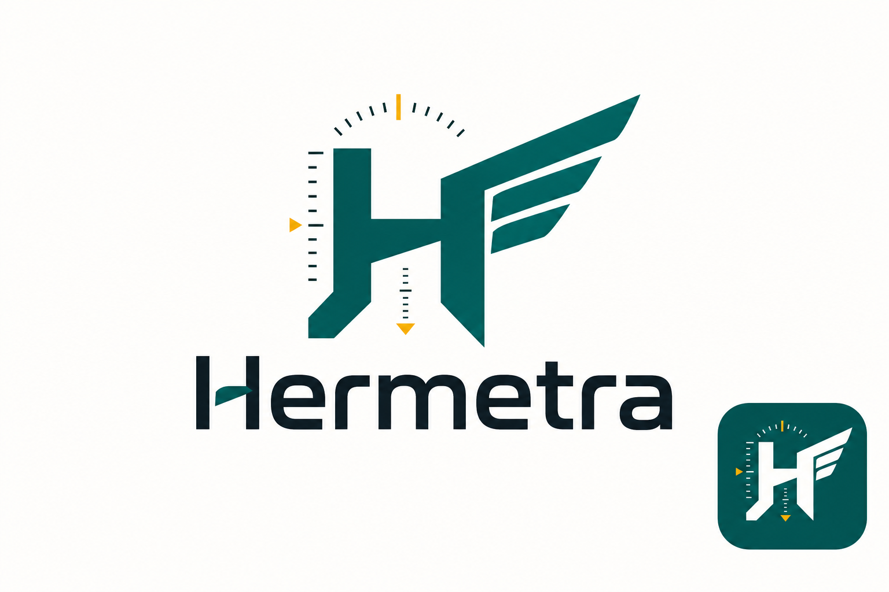

# Hermetra

[한국어](./README.ko.md)



## Brand Concept

**Hermetra** combines `Hermes` and `Metra`.

Hermes represents speed, movement, and message delivery. Metra represents measurement and harvesting. Hermetra is a desktop automation tool for quickly finding information across web and mobile surfaces, measuring what matters, and harvesting it through repeatable automation workflows.

The project exists to go beyond one-off crawling or scraping. It aims to provide a structured automation layer where users can collect, connect, and manage the information they want over time.

Hermetra focuses on:

- Web and mobile automation scripts
- Integration between browser and mobile automation flows
- Collection of news, job posts, product data, and hyperlinks
- Reusable scenarios for recurring information-gathering workflows

The brand direction is **fast discovery**, **precise measurement**, and **automated harvest**.

## Quick Start

```bash
npm install
npm run dev        # launch Electron in dev mode with HMR
npm run build      # bundle main / preload / renderer
npm run typecheck  # tsc -p tsconfig.node.json && tsc -p tsconfig.web.json
```

## License

Licensed under the GNU Affero General Public License v3.0. See [LICENSE](./LICENSE).

Copyright (c) 2026 이민형(MinHyung RHIE).
